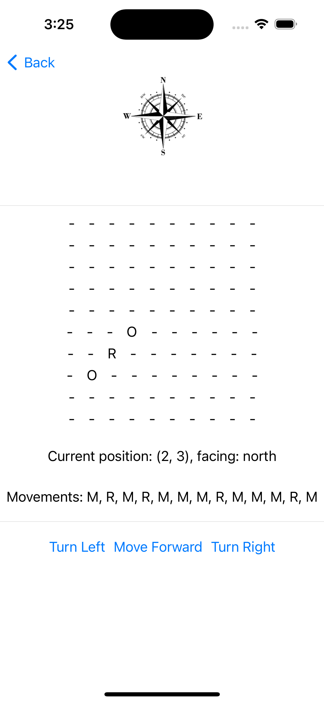
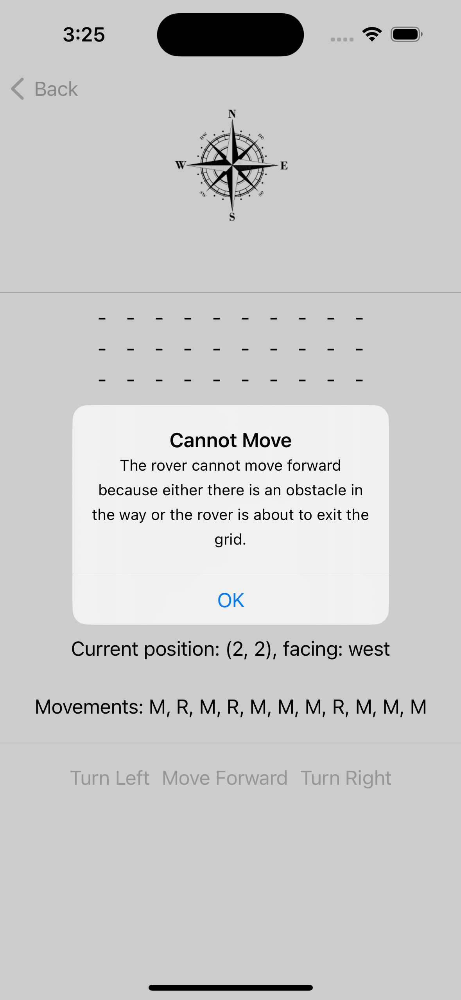
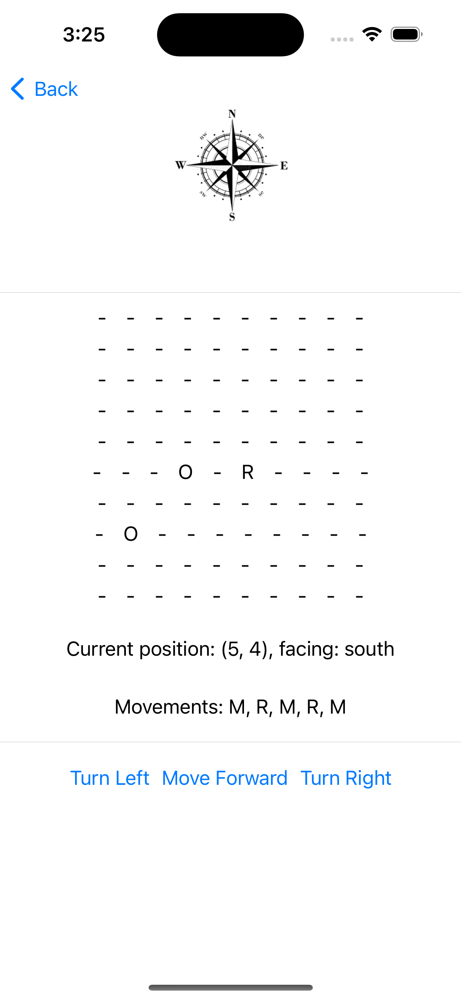
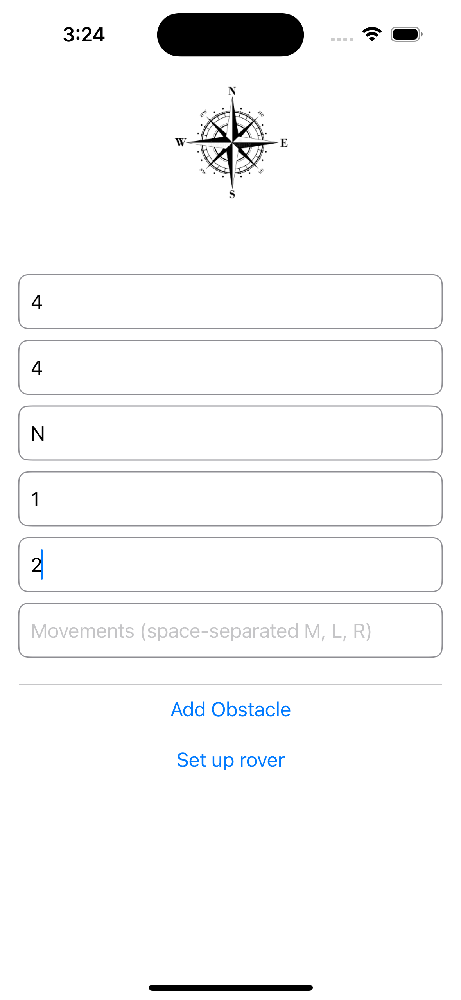
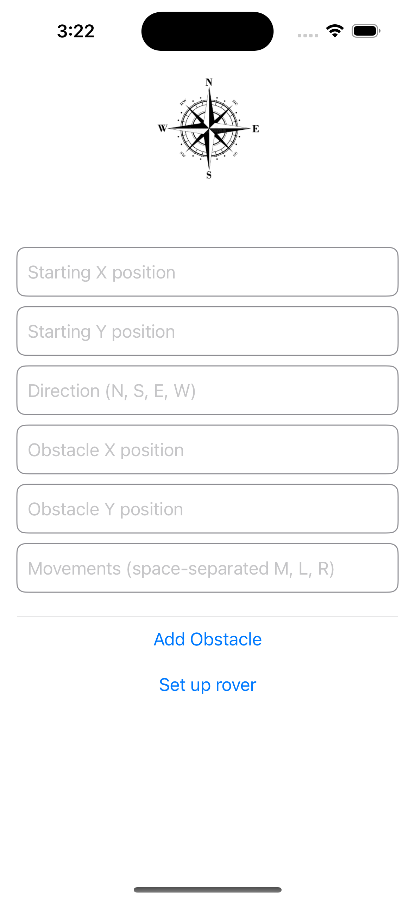

# Mars Rover

Mars Rover is a rover simulator application that allows users to navigate a virtual rover through obstacles and diverse landscapes. The app is built using Swift and SwiftUI.

## Screenshots

<div style="display: flex; flex-wrap: wrap; justify-content: space-around;">
    
    
    
    
    
    
</div>

## Working of the App

https://github.com/Sarthak309/MarsRover/assets/103929885/51e369a7-4561-4941-b906-37f68cab15e2


## Features
- Virtual rover navigation
- Obstacle avoidance
- Diverse landscapes

## Installation

1. Clone the repository:
    ```sh
    git clone https://github.com/Sarthak309/MarsRover.git
    ```

2. Open the project in Xcode:
    ```sh
    cd MarsRover
    open MarsRover.xcodeproj
    ```

3. Install dependencies using CocoaPods (if applicable):
    ```sh
    pod install
    ```

4. Build and run the app on your simulator or device.

## Usage

1. Open the app on your iOS device.
2. Set the start location for the rover.
3. Navigate the rover through obstacles and landscapes.

## Technologies Used
- Swift
- SwiftUI

## License
This project is licensed under the MIT License - see the [LICENSE](LICENSE) file for details.
